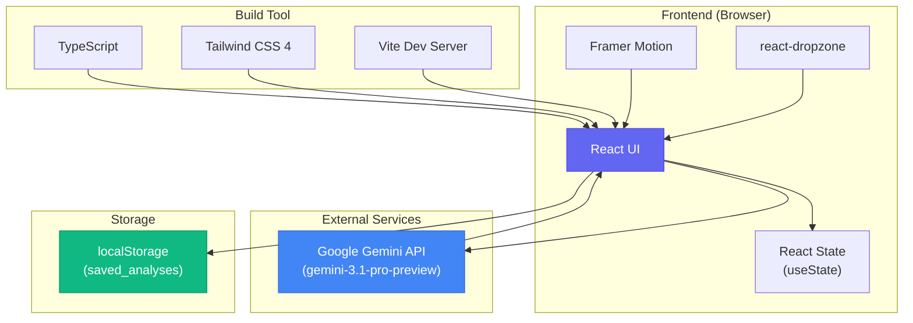
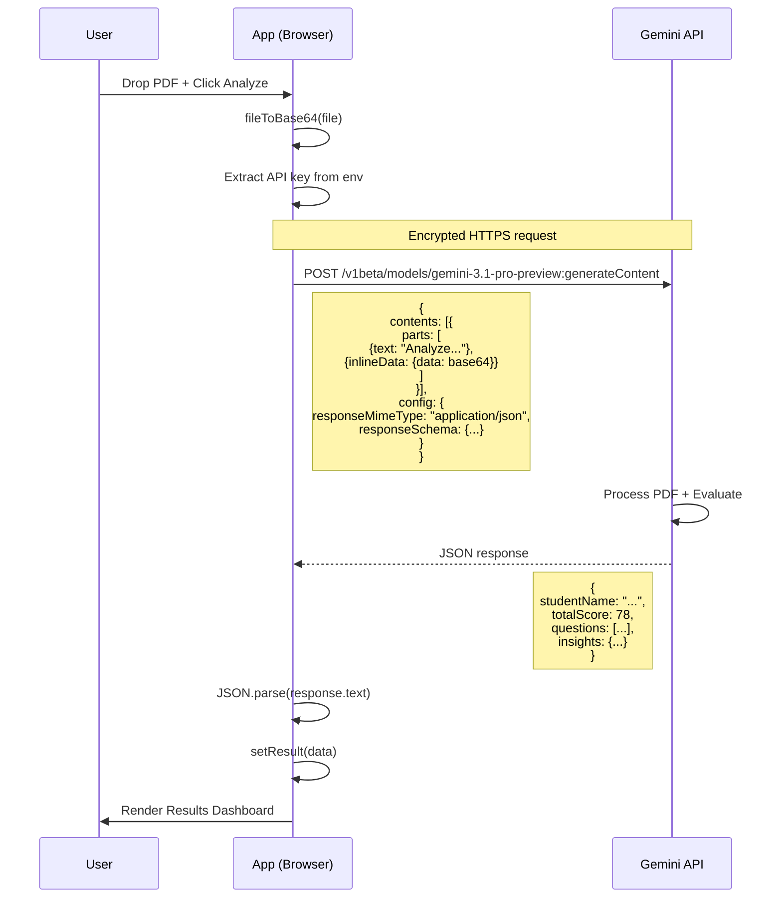

import { Callout, Tabs, Tab } from 'nextra/components'

<div align="center">

# ExamGrade AI

### Precision Grading for Modern Educators

*An AI-powered exam answer sheet analyzer that transforms handwritten papers into actionable insights.*


---

[](https://react.dev)
[](https://typescriptlang.org)
[](https://vitejs.dev)
[](https://tailwindcss.com)
[](https://ai.google.dev)

</div>

---

## Table of Contents

- [Overview](#overview)
- [How It Works](#how-it-works)
- [Architecture](#architecture)
- [Tech Stack](#tech-stack)
- [Application Flow](#application-flow)
- [Features](#features)
- [Data Model](#data-model)
- [Getting Started](#getting-started)
- [Project Structure](#project-structure)
- [API Integration](#api-integration)
- [Scoring System](#scoring-system)
- [Roadmap](#roadmap)

---

## Overview

ExamGrade AI is a web application that leverages Google's Gemini multimodal AI to automatically grade student exam answer sheets. Teachers upload a PDF of a handwritten answer sheet, and the AI extracts questions, evaluates answers, scores performance, and provides detailed feedback — all in seconds.

```
┌─────────────────────────────────────────────────────────────────┐
│                                                                 │
│    ┌──────────┐         ┌──────────────┐         ┌──────────┐  │
│    │  Teacher │ ──────▶ │  ExamGrade   │ ──────▶ │  Graded  │  │
│    │          │         │     AI       │         │  Report  │  │
│    └──────────┘         └──────────────┘         └──────────┘  │
│         │                      │                      │        │
│         ▼                      ▼                      ▼        │
│    ┌──────────┐         ┌──────────────┐         ┌──────────┐  │
│    │  Upload  │         │   Gemini     │         │ Insights │  │
│    │   PDF    │         │   Analysis   │         │  & Marks │  │
│    └──────────┘         └──────────────┘         └──────────┘  │
│                                                                 │
└─────────────────────────────────────────────────────────────────┘
```

### Key Capabilities

| Feature | Description |
|---------|-------------|
| **PDF Upload** | Drag-and-drop or click to upload student answer sheets |
| **AI Analysis** | Gemini reads handwriting, extracts Q&A, evaluates answers |
| **Auto-Scoring** | Marks assigned per question, normalized to /100 |
| **Insights** | Strengths, weaknesses, handwriting quality, relevancy scores |
| **Topic Breakdown** | Performance grouped by topic with visual bars |
| **Editable Marks** | Teachers can override AI-assigned marks |
| **Save & Export** | Save analyses to local storage for future reference |

---

## How It Works

```
╔══════════════════════════════════════════════════════════════════╗
║                    EXAMGRADE AI — END-TO-END FLOW               ║
╚══════════════════════════════════════════════════════════════════╝

  ┌─────────────────────────────────────────────────────────────┐
  │  STEP 1: CONFIGURE                                          │
  │  ─────────────────                                          │
  │  Teacher selects Class (8-12) and Subject from the header   │
  └─────────────────────────┬───────────────────────────────────┘
                            │
                            ▼
  ┌─────────────────────────────────────────────────────────────┐
  │  STEP 2: UPLOAD                                             │
  │  ──────────────                                             │
  │  Teacher drops a PDF of the student's answer sheet          │
  │  File is validated (PDF only) and stored in state           │
  └─────────────────────────┬───────────────────────────────────┘
                            │
                            ▼
  ┌─────────────────────────────────────────────────────────────┐
  │  STEP 3: ANALYZE                                            │
  │  ────────────────                                           │
  │  PDF → Base64 → Gemini API                                  │
  │  AI extracts questions, answers, evaluates, scores          │
  └─────────────────────────┬───────────────────────────────────┘
                            │
                            ▼
  ┌─────────────────────────────────────────────────────────────┐
  │  STEP 4: REVIEW                                             │
  │  ──────────────                                             │
  │  Teacher sees graded report with:                           │
  │  • Total score (/100)                                       │
  │  • Per-question breakdown with marks & reasoning            │
  │  • Strengths & weaknesses                                   │
  │  • Topic-wise performance bars                              │
  └─────────────────────────┬───────────────────────────────────┘
                            │
                            ▼
  ┌─────────────────────────────────────────────────────────────┐
  │  STEP 5: REFINE & SAVE                                      │
  │  ─────────────────────                                      │
  │  Teacher can edit marks per question, then save to storage  │
  └─────────────────────────────────────────────────────────────┘
```

---

## Architecture

### High-Level Architecture



### Component Hierarchy

```
App (main component)
├── Header (sticky top bar)
│   ├── Logo + Brand Name
│   ├── Class Selector (dropdown)
│   └── Subject Selector (dropdown)
│
├── Upload View (when no result)
│   ├── Hero Section (title + subtitle)
│   ├── Dropzone (PDF upload area)
│   ├── Error Display (if any)
│   └── Analyze Button
│
├── Results View (when result exists)
│   ├── Left Column (4/12 width)
│   │   ├── Summary Card (name + total score)
│   │   ├── Score Metrics (handwriting, relevancy, sentence)
│   │   ├── Insights Card (strengths + weaknesses)
│   │   ├── Performance Insight (short vs long comparison)
│   │   ├── Topic Performance (bar chart)
│   │   └── Action Buttons (save + new analysis)
│   │
│   └── Right Column (8/12 width)
│       ├── Question Count Badge
│       └── Question Cards (for each question)
│           ├── Question Header (number, type, topic)
│           ├── Marks Input (editable)
│           ├── Relevancy Bar
│           ├── Student Answer
│           └── AI Reasoning
│
└── Footer (brand + links)
```

---

## Tech Stack

<div align="center">

```
┌────────────────────────────────────────────────────────────────┐
│                        TECH STACK                              │
├────────────────────────────────────────────────────────────────┤
│                                                                │
│   ┌─────────────┐    ┌─────────────┐    ┌─────────────┐      │
│   │   React 19  │    │ TypeScript  │    │   Vite 6    │      │
│   │   Frontend  │    │   5.8       │    │  Dev Server │      │
│   └──────┬──────┘    └──────┬──────┘    └──────┬──────┘      │
│          │                  │                   │              │
│          ▼                  ▼                   ▼              │
│   ┌─────────────────────────────────────────────────────┐     │
│   │              Build Pipeline                          │     │
│   │  Vite + @vitejs/plugin-react + @tailwindcss/vite   │     │
│   └─────────────────────────────────────────────────────┘     │
│                          │                                     │
│   ┌──────────────────────┼──────────────────────┐             │
│   │                      │                      │             │
│   ▼                      ▼                      ▼             │
│ ┌──────────┐    ┌──────────────┐    ┌──────────────┐         │
│ │ Tailwind │    │   Framer     │    │   Lucide     │         │
│ │ CSS 4    │    │   Motion     │    │   Icons      │         │
│ │ Styling  │    │  Animation   │    │   SVGs       │         │
│ └──────────┘    └──────────────┘    └──────────────┘         │
│                                                                │
│   ┌──────────────┐    ┌──────────────┐    ┌──────────────┐   │
│   │ @google/     │    │ react-       │    │ clsx +       │   │
│   │ genai 1.29   │    │ dropzone     │    │ tailwind-    │   │
│   │ Gemini SDK   │    │ File Upload  │    │ merge        │   │
│   └──────────────┘    └──────────────┘    └──────────────┘   │
│                                                                │
└────────────────────────────────────────────────────────────────┘
```

</div>

| Layer | Technology | Version | Purpose |
|-------|-----------|---------|---------|
| **UI** | React | 19.0 | Component-based UI rendering |
| **Language** | TypeScript | 5.8 | Type safety & developer experience |
| **Bundler** | Vite | 6.2 | Fast HMR, build tooling |
| **Styling** | Tailwind CSS | 4.1 | Utility-first CSS framework |
| **Animation** | Framer Motion | 12.35 | Smooth transitions & animations |
| **Icons** | Lucide React | 0.546 | Consistent SVG icon library |
| **AI** | Google GenAI | 1.29 | Gemini API client |
| **Upload** | react-dropzone | 15.0 | PDF drag-and-drop handling |
| **Utilities** | clsx + tailwind-merge | — | Conditional class merging |

---

## Application Flow

### State Machine

```
                    ┌───────────────────────────────────┐
                    │                                   │
                    │           IDLE STATE              │
                    │     (No file, No result)          │
                    │                                   │
                    └───────────────┬───────────────────┘
                                    │
                         User drops/selects PDF
                                    │
                                    ▼
                    ┌───────────────────────────────────┐
                    │                                   │
                    │         FILE READY STATE          │
                    │   (File selected, ready to go)    │
                    │                                   │
                    └───────────────┬───────────────────┘
                                    │
                        User clicks "Start Analysis"
                                    │
                                    ▼
                    ┌───────────────────────────────────┐
                    │                                   │
                    │        ANALYZING STATE            │
                    │    (API call in progress)         │
                    │                                   │
                    └───────┬───────────────┬───────────┘
                            │               │
                        Success          Error
                            │               │
                            ▼               ▼
                    ┌──────────┐    ┌──────────────────┐
                    │  RESULT  │    │   ERROR STATE    │
                    │  STATE   │    │  (Retry option)  │
                    └────┬─────┘    └──────────────────┘
                         │
          ┌──────────────┼──────────────┐
          │              │              │
     Edit marks    Save analysis   New analysis
          │              │              │
          ▼              ▼              ▼
    ┌──────────┐   ┌──────────┐   ┌──────────┐
    │  UPDATE  │   │ SAVING → │   │  RESET   │
    │  RESULT  │   │  SAVED   │   │  TO IDLE │
    └──────────┘   └──────────┘   └──────────┘
```

### Data Flow Diagram

```
┌─────────────────────────────────────────────────────────────────────┐
│                         DATA FLOW                                   │
│                                                                     │
│  User Action          State Update           UI Render              │
│  ───────────          ────────────           ─────────              │
│                                                                     │
│  Select Class   ──▶  setSelectedClass()  ──▶  Header updates       │
│  Select Subject ──▶  setSelectedSubject() ──▶ Header updates       │
│  Drop PDF       ──▶  setFile()           ──▶  Dropzone shows name  │
│  Click Analyze  ──▶  setIsAnalyzing(true) ──▶ Spinner shown        │
│  API Success    ──▶  setResult(data)     ──▶  Results view shown   │
│  API Error      ──▶  setError(msg)       ──▶  Error alert shown    │
│  Edit marks     ──▶  setResult(updated)  ──▶  Score recalculated   │
│  Save           ──▶  setSaveStatus()     ──▶  Button state changes │
│  New Analysis   ──▶  setResult(null)     ──▶  Back to upload view  │
│                                                                     │
└─────────────────────────────────────────────────────────────────────┘
```

### API Request/Response Cycle



---

## Features

### 1. Intelligent PDF Processing

The application accepts PDF answer sheets via a drag-and-drop interface. The file is converted to Base64 and sent to Gemini's multimodal API, which can:

- **Read handwritten text** — even with varying handwriting quality
- **Parse question/answer structure** — automatically identifies question boundaries
- **Understand context** — evaluates answers relative to the question asked
- **Apply curriculum knowledge** — follows Indian CBSE/ICSE marking standards

```
┌─────────────────────────────────────────────────────────────┐
│                    PDF PROCESSING PIPELINE                   │
│                                                             │
│  ┌─────────┐   ┌──────────┐   ┌─────────┐   ┌──────────┐ │
│  │  PDF    │──▶│ FileReader│──▶│ Base64  │──▶│ Gemini   │ │
│  │  File   │   │ .readAs  │   │ String  │   │ API      │ │
│  │         │   │ DataURL  │   │         │   │          │ │
│  └─────────┘   └──────────┘   └─────────┘   └──────────┘ │
│                                                             │
│  Time:  ~0ms      ~50ms         ~100ms        ~3-8s       │
│                                                             │
└─────────────────────────────────────────────────────────────┘
```

### 2. Multi-Subject Support

Supports 14 academic subjects across the Indian curriculum:

```
┌──────────────────────────────────────────────────────────────┐
│                      SUBJECT COVERAGE                         │
├──────────────────────────────────────────────────────────────┤
│                                                              │
│  CORE SCIENCE          HUMANITIES         LANGUAGES          │
│  ────────────          ──────────         ─────────          │
│  • Physics             • History          • English          │
│  • Chemistry           • Geography        • Hindi            │
│  • Biology             • Economics        • Sanskrit         │
│                        • Political Sci                       │
│                                                              │
│  MATHEMATICS           OTHER                                   │
│  ───────────           ─────                                   │
│  • Mathematics         • Computer App                        │
│  • Science             • Social Science                      │
│                                                              │
│  CLASS LEVELS: Class 8 │ Class 9 │ Class 10 │ Class 11 │ 12  │
│                                                              │
└──────────────────────────────────────────────────────────────┘
```

### 3. Comprehensive Grading Engine

Gemini evaluates each answer on multiple dimensions:

| Dimension | What It Measures | Score Range |
|-----------|-----------------|-------------|
| **Relevancy** | How directly the answer addresses the question | 0–100% |
| **Correctness** | Factual accuracy and completeness | Marks assigned |
| **Handwriting** | Legibility and neatness | 1–10 |
| **Sentence Formation** | Grammar, structure, clarity | 1–10 |
| **Overall Quality** | Combined assessment | Marks per question |

### 4. Smart Score Normalization

```
Raw Marks Calculation:
━━━━━━━━━━━━━━━━━━━━━━━━━━━━━━━━━━━━━━━━━━━━━━━━━━━━━━━━━━━━

  Question 1:  3/5 marks  ─┐
  Question 2:  5/5 marks   │
  Question 3:  2/3 marks   ├──▶  Total: 42/63
  Question 4:  8/10 marks  │
  Question 5:  4/5 marks  ─┘

  Normalized: (42/63) × 100 = 67/100

━━━━━━━━━━━━━━━━━━━━━━━━━━━━━━━━━━━━━━━━━━━━━━━━━━━━━━━━━━━━
```

### 5. Topic-Wise Performance Analytics

```
Topic Performance Breakdown:
━━━━━━━━━━━━━━━━━━━━━━━━━━━━━━━━━━━━━━━━━━━━━━━━━━━━━━━━━━━━

  Algebra          ████████████████████████████░░  87%  (4 Qs)
  Geometry         ██████████████████████░░░░░░░░  72%  (3 Qs)
  Calculus         ████████████████░░░░░░░░░░░░░░  53%  (2 Qs)
  Statistics       ████████████████████████████░░  90%  (2 Qs)
  Trigonometry     ██████████████░░░░░░░░░░░░░░░░  45%  (1 Q)

  ━━━━━━━━━━━━━━━━━━━━━━━━━━━━━━━━━━━━━━━━━━━━━━━━━━━━━━━━━━━
  Legend: ████ > 80% Strong  ████ 50-80% Average  ████ < 50% Weak
```

### 6. Editable Marks with Live Recalculation

Teachers can override AI-assigned marks. The system instantly recalculates:

```
┌────────────────────────────────────────────────────────────────┐
│  EDITABLE MARKS FLOW                                           │
│                                                                │
│  Teacher edits marks input                                     │
│         │                                                      │
│         ▼                                                      │
│  updateQuestionMarks(id, newMarks)                             │
│         │                                                      │
│         ├──▶ Clamp to maxMarks: Math.min(new, max)             │
│         │                                                      │
│         ├──▶ Update question in array                          │
│         │                                                      │
│         └──▶ Recalculate totalScore                            │
│                    │                                           │
│                    ▼                                           │
│              setResult({...updated})                           │
│                    │                                           │
│                    ▼                                           │
│              UI re-renders with new score                      │
│                                                                │
└────────────────────────────────────────────────────────────────┘
```

### 7. Save & History

Analyses are persisted to `localStorage` with metadata:

```json
{
  "id": "1718630400000",
  "savedAt": "2026-06-17T10:30:00.000Z",
  "class": "Class 10",
  "subject": "Mathematics",
  "studentName": "Rahul Sharma",
  "totalScore": 78,
  "questions": [...],
  "insights": {...}
}
```

---

## Data Model

### Core Types

```typescript
// The complete analysis result from Gemini
interface AnalysisResult {
  studentName: string;           // Extracted from the answer sheet
  totalScore: number;            // Normalized to /100
  questions: QuestionAnalysis[]; // Per-question breakdown
  insights: GradingInsights;     // Overall feedback & scores
}

// Individual question analysis
interface QuestionAnalysis {
  id: string;                    // Unique identifier
  questionNumber: number;        // Sequential number
  questionText: string;          // The question as written
  studentAnswer: string;         // Student's response
  marks: number;                 // AI-assigned (editable)
  maxMarks: number;              // Maximum possible
  relevancyRate: number;         // 0-100 percentage
  reasoning: string;             // AI feedback for this question
  topic: string;                 // Topic categorization
  type: 'short' | 'long';       // Answer length classification
}

// Overall grading insights
interface GradingInsights {
  strengths: string[];           // What the student did well
  weaknesses: string[];          // Areas needing improvement
  handwritingScore: number;      // 1-10 legibility score
  relevancyScore: number;        // 1-10 relevance to questions
  sentenceFormationScore: number;// 1-10 grammar & clarity
  overallFeedback: string;       // Summary paragraph
  shortVsLongComparison: string; // Short vs long answer analysis
}
```

### Data Flow Diagram

```
┌─────────────────────────────────────────────────────────────────────┐
│                        DATA MODEL                                   │
│                                                                     │
│  ┌──────────────┐                                                  │
│  │  File (PDF)  │                                                  │
│  └──────┬───────┘                                                  │
│         │                                                          │
│         ▼                                                          │
│  ┌──────────────┐     ┌──────────────────┐                        │
│  │  Base64      │────▶│  Gemini API      │                        │
│  │  String      │     │  Request         │                        │
│  └──────────────┘     └────────┬─────────┘                        │
│                                │                                    │
│                                ▼                                    │
│                    ┌──────────────────────┐                        │
│                    │  AnalysisResult      │                        │
│                    │  ├── studentName     │                        │
│                    │  ├── totalScore      │                        │
│                    │  ├── questions[]     │                        │
│                    │  │   ├── id          │                        │
│                    │  │   ├── marks       │◀── Teacher editable    │
│                    │  │   ├── maxMarks    │                        │
│                    │  │   ├── relevancy   │                        │
│                    │  │   ├── reasoning   │                        │
│                    │  │   ├── topic       │                        │
│                    │  │   └── type        │                        │
│                    │  └── insights        │                        │
│                    │      ├── strengths   │                        │
│                    │      ├── weaknesses  │                        │
│                    │      └── scores[]    │                        │
│                    └──────────────────────┘                        │
│                              │                                      │
│                              ▼                                      │
│                    ┌──────────────────────┐                        │
│                    │  localStorage        │                        │
│                    │  (saved_analyses[])  │                        │
│                    └──────────────────────┘                        │
│                                                                     │
└─────────────────────────────────────────────────────────────────────┘
```

---

## Getting Started

### Prerequisites

- **Node.js** 18+ (recommended: 20 LTS)
- **npm** 9+ or **yarn** 1.22+
- **Google Gemini API Key** — Get one at [aistudio.google.com](https://aistudio.google.com/apikey)

### Installation

<Tabs items={['npm', 'yarn', 'pnpm']}>
  <Tab>
    ```bash
    npm install
    ```
  </Tab>
  <Tab>
    ```bash
    yarn install
    ```
  </Tab>
  <Tab>
    ```bash
    pnpm install
    ```
  </Tab>
</Tabs>

### Configuration

Create a `.env.local` file in the project root:

```bash
# Required: Your Gemini API key
GEMINI_API_KEY="your-api-key-here"

# Optional: Disable HMR in dev
DISABLE_HMR="false"
```

### Running the App

```bash
# Development server (port 3000)
npm run dev

# Production build
npm run build

# Preview production build
npm run preview

# Type checking
npm run lint
```

The app will be available at **http://localhost:3000**

---

## Project Structure

```
examgrade-ai/
├── index.html                 # Entry HTML with root div
├── package.json               # Dependencies & scripts
├── tsconfig.json              # TypeScript configuration
├── vite.config.ts             # Vite build configuration
├── metadata.json              # App metadata (name, description)
├── .env.example               # Environment variable template
├── .gitignore                 # Git ignore rules
│
└── src/
    ├── main.tsx               # React entry point (StrictMode + root render)
    ├── index.css              # Tailwind CSS import
    └── App.tsx                # Main application component (615 lines)
        │
        ├── Constants
        │   ├── CLASSES        # ['Class 8' ... 'Class 12']
        │   └── SUBJECTS       # 14 academic subjects
        │
        ├── Types
        │   ├── QuestionAnalysis
        │   ├── GradingInsights
        │   └── AnalysisResult
        │
        ├── Hooks (inline)
        │   ├── useState       # File, result, error, save status
        │   ├── useCallback    # onDrop handler
        │   └── useMemo        # topicPerformance calculation
        │
        ├── Functions
        │   ├── cn()           # Tailwind class merger utility
        │   ├── fileToBase64() # PDF → Base64 conversion
        │   ├── analyzePaper() # Gemini API call
        │   ├── saveAnalysis() # localStorage persistence
        │   └── updateQuestionMarks() # Edit marks + recalculate
        │
        └── Sub-components
            ├── ScoreMetric    # Individual score bar (handwriting, etc.)
            └── [inline JSX]   # Header, Dropzone, Results, Footer
```

---

## API Integration

### Gemini API Configuration

The app uses Google's `@google/genai` SDK to communicate with the Gemini API.

**Model:** `gemini-3.1-pro-preview`

**Request Structure:**

```typescript
{
  contents: [{
    parts: [
      { text: "Analyze this student's exam answer sheet..." },
      { inlineData: { mimeType: "application/pdf", data: base64 } }
    ]
  }],
  config: {
    responseMimeType: "application/json",
    responseSchema: {
      type: Type.OBJECT,
      properties: {
        studentName: { type: Type.STRING },
        totalScore: { type: Type.NUMBER },
        questions: { type: Type.ARRAY, items: { /* QuestionAnalysis */ } },
        insights: { type: Type.OBJECT, properties: { /* GradingInsights */ } }
      }
    }
  }
}
```

**Response Handling:**

```typescript
const response = await ai.models.generateContent({...});
const data = JSON.parse(response.text);
setResult(data);
```

### Error Handling

```
┌────────────────────────────────────────────────────────────────┐
│                    ERROR HANDLING FLOW                          │
│                                                                │
│  ┌──────────────┐                                             │
│  │  API Call     │                                             │
│  └──────┬───────┘                                             │
│         │                                                      │
│    ┌────┴────┐                                                │
│    │         │                                                │
│  Success   Error                                              │
│    │         │                                                │
│    ▼         ▼                                                │
│  parse    ┌─────────────────────────────────┐                │
│  JSON     │  Possible Errors:                │                │
│    │      │  • Missing API key              │                │
│    ▼      │  • Invalid PDF                  │                │
│  setResult│  • API rate limit               │                │
│    │      │  • Network failure              │                │
│    ▼      │  • Malformed response           │                │
│  Render   └──────────┬──────────────────────┘                │
│  Results              │                                       │
│                       ▼                                       │
│                  setError(msg)                                │
│                       │                                       │
│                       ▼                                       │
│                  Show error alert with                        │
│                  retry option                                 │
│                                                                │
└────────────────────────────────────────────────────────────────┘
```

---

## Scoring System

### How Marks Are Assigned

The AI assigns marks based on multiple factors:

```
┌────────────────────────────────────────────────────────────────┐
│                  SCORING DIMENSIONS                             │
│                                                                │
│  ┌────────────────────────────────────────────────────────┐   │
│  │                                                        │   │
│  │   Relevancy (0-100%)                                  │   │
│  │   ████████████████████████░░░░░░  78%                  │   │
│  │   "Answer addresses the core question"                 │   │
│  │                                                        │   │
│  │   Correctness                                         │   │
│  │   Determined by marks assigned (0 to max)              │   │
│  │   "Factual accuracy and completeness"                  │   │
│  │                                                        │   │
│  │   Handwriting (1-10)                                  │   │
│  │   ██████████████████░░░░░░░░░░░░  6/10                 │   │
│  │   "Legibility and neatness"                            │   │
│  │                                                        │   │
│  │   Sentence Formation (1-10)                            │   │
│  │   ████████████████████████████░░  8/10                 │   │
│  │   "Grammar, structure, clarity"                        │   │
│  │                                                        │   │
│  └────────────────────────────────────────────────────────┘   │
│                                                                │
│  TOTAL SCORE = (Σ earned marks / Σ max marks) × 100           │
│                                                                │
└────────────────────────────────────────────────────────────────┘
```

### Score Interpretation

| Range | Grade | Color | Meaning |
|-------|-------|-------|---------|
| 90–100 | A+ | 🟢 Green | Excellent — outstanding performance |
| 80–89 | A | 🟢 Green | Very Good — strong understanding |
| 70–79 | B | 🔵 Blue | Good — solid grasp of concepts |
| 60–69 | C | 🟡 Yellow | Average — needs some improvement |
| 50–59 | D | 🟡 Yellow | Below Average — significant gaps |
| < 50 | F | 🔴 Red | Failing — requires major improvement |

---

## Roadmap

### Planned Enhancements

```
┌─────────────────────────────────────────────────────────────────┐
│                      FUTURE ROADMAP                              │
├─────────────────────────────────────────────────────────────────┤
│                                                                 │
│  PHASE 1 — Core Improvements                                    │
│  ─────────────────────────────                                  │
│  [ ] Batch processing (multiple papers at once)                 │
│  [ ] PDF export of graded reports                               │
│  [ ] Class-wise analytics dashboard                             │
│  [ ] Student performance history tracking                       │
│                                                                 │
│  PHASE 2 — Enhanced AI                                          │
│  ─────────────────────────                                      │
│  [ ] Custom rubric support (teacher-defined scoring)            │
│  [ ] Comparative analysis (student vs class average)            │
│  [ ] Plagiarism detection across submissions                    │
│  [ ] Multi-language answer support                              │
│                                                                 │
│  PHASE 3 — Collaboration                                        │
│  ───────────────────────────                                    │
│  [ ] Multi-teacher workspace with role-based access             │
│  [ ] Comment & annotation system                                │
│  [ ] Share reports via email/WhatsApp                           │
│  [ ] Integration with school LMS platforms                      │
│                                                                 │
│  PHASE 4 — Advanced Analytics                                   │
│  ──────────────────────────────                                 │
│  [ ] Predictive performance modeling                            │
│  [ ] Question difficulty analysis                               │
│  [ ] Automatic question paper generation from weak areas        │
│  [ ] Real-time exam proctoring integration                      │
│                                                                 │
└─────────────────────────────────────────────────────────────────┘
```

---

## Environment Variables

| Variable | Required | Description |
|----------|----------|-------------|
| `GEMINI_API_KEY` | Yes | Google Gemini API key for AI analysis |
| `APP_URL` | No | Application URL (injected by AI Studio) |
| `DISABLE_HMR` | No | Set to `"true"` to disable hot module replacement |

---

## Contributing

1. Fork the repository
2. Create a feature branch (`git checkout -b feature/amazing-feature`)
3. Commit changes (`git commit -m 'Add amazing feature'`)
4. Push to branch (`git push origin feature/amazing-feature`)
5. Open a Pull Request

---

## License

This project is licensed under the **Apache 2.0 License** — see the [LICENSE](LICENSE) file for details.

---

<div align="center">

**Built with AI-powered precision for educators worldwide.**

[View on AI Studio](https://ai.studio/apps/b1ce410f-4e7d-4ae0-80d1-bc9b339c9b8b)

</div>
